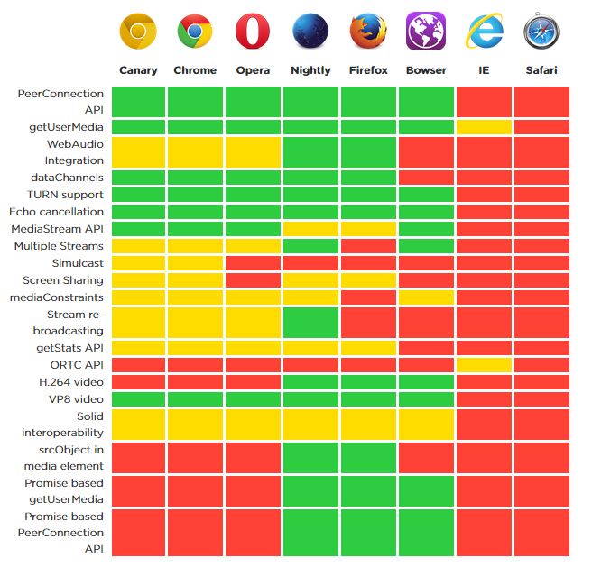
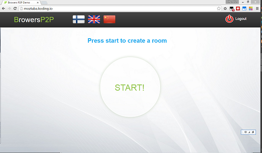
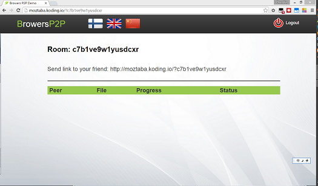
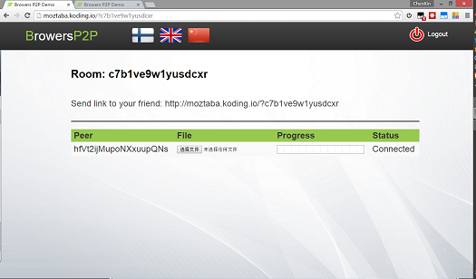
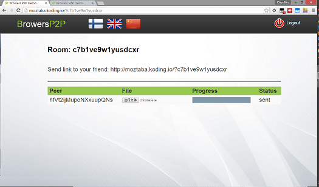
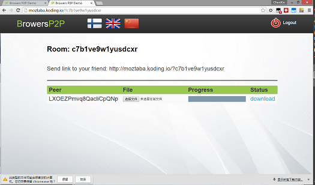
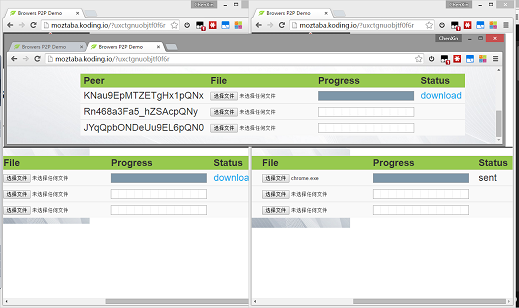

# Web Browsers P2P
> IT Infrastructure

##Introduction
We are going to archive Peer-to-Peer file transfer between web browsers. 
By using webRTC, data could transfer between browsers without any data servers.

Here is the same stuff what we are going to do [reep.io](https://reep.io/).

##Dependencies
- [jQuery](https://jquery.com/)
- [simplyWebRTC](http://simplewebrtc.com)
- [GoogleFonts](https://www.google.com/fonts)

##Browers Support
We have used webRTC so it depends which brower supports webRTC.
But we are sure it could run on Chrome 41+.

You can find more information on:
- [iswebrtcreadyyet.com](http://iswebrtcreadyyet.com/)
- [simplewebrtc.com](http://simplewebrtc.com/)

##Features
Actually, this version is not a full version. You can share files to friends without any servers but it is not a peers-to-peers network. Which means the content serving capacity can't actually increase as more users begin to access the content. Maybe we can archive this part after half a year or longer?

##Instructions
1.Open the website and click the start button to create a room for your friends.
2.Now you have created a room, send the link to your friends so that they can get into your room with it.
3.You can see each others who have visit the link on the list.
4.Click the button to send them a file.
5.Download the file who sent it.
6.You can also share the file with more than two friends.

##Demo
Please visit [Online Demo](http://doubleshift.github.io/WebBrowsers-P2P/).
You can open two browser tabs for test.

##Code
You can always download the latest source code [here](https://github.com/DoubleShift/WebBrowsers-P2P/archive/master.zip)
